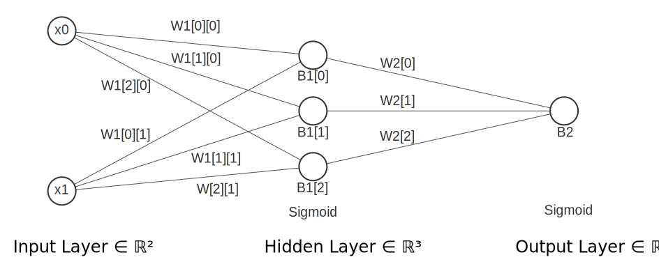

Neural Network on 8-bits?
======

XOR neural network is one of the basic and simplest neural networks. It is trained by XOR gate input as input features and XOR gate output as the prediction. A basic XOR gate can be created using 3 layers neural network. The architecture that I have used and how I inferred it on FPGA is discussed here onwards.


The architecture of the network
------

Cool thing in machine learning, you can decide the architecture. So in this case I defined the archtecture as below.


- Input Layer Units = 2
- Hidden Layer Units = 3
- Output Layer Units = 1
- No. of hidden layers = 1
- Learning Algorithm : Back-propagation



Detailed model of the Network
-----

Using python the Network was created and trained. You can find the src [here](nn/XOR-Net-Notebook.ipynb). After the 50000th iteration, the accuracy was at an acceptable level. Then the weights were saved and the model was created using raw python arrays to directly port the algorithm into Verilog.

Python tuned weights were as follows
----

```shell
W1 = [[ 4.74185753, -6.13103778], [-3.50823244, -4.63758001], [ 5.51520192, -3.77964294]]
W2 = [ 7.5194821, -4.41987076, -6.63780666]
B1 = [-2.32319703,0.72576663,1.32843545]
B2 = [3.38932348]
```

Based on the weight values 8-bit(signed) was selected as the word length for the Hardware architecture. all the weights were multiplied by 10 in order to convert them between 127 to -128. (Multiplying this by 8 will increase the accuracy further)

converted weights are as follows
```shell
W1[0][0] = 47
W1[0][1] =-61
W1[1][0] =- 35
W1[1][1] =- 6
W1[2][0] = 55
W1[2][1] =- 37
W2[0] = 75
W2[1] =- 44
W2[2] =- 66
B1[0] =- 23
B1[1] = 7
B1[2] = 13
B2=33
```

Sigmoid Activation Function
----

Since we cannot implement the Sigmoid function on Hardware directly a lookup table was used instead of using the Sigmoid function. Sigmoid function outputs values between 1 and 0. But for the hardware implementation, Sigmoid functions had to scale from 100 to 0. So that values fit in the range of 8-bit signed values (Max 127 and min -128). A python script was created to generate the required mapping of the Sigmoid function.
Final accuracy on FPGA

Final accuracy on FPGA
------

| x1 | x0 | Expected | Prediction |
|:--:|:--:|:--------:|:----------:|
|  0 |  0 |     0    |      8     |
|  0 |  1 |    100   |     96     |
|  1 |  0 |    100   |     94     |
|  1 |  1 |     0    |     19     |

With the 8-bit word size and a slight modification to the mathematical model of the neural network, this hardware implementation can be done.

It is fascinating and I had fun combining complex mathematical models with fundamental logic circuits.
